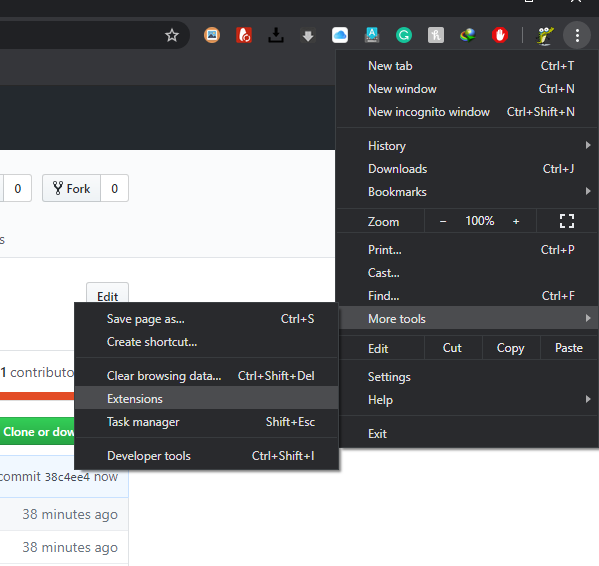
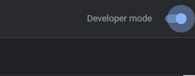
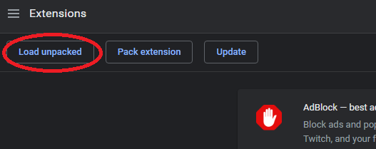
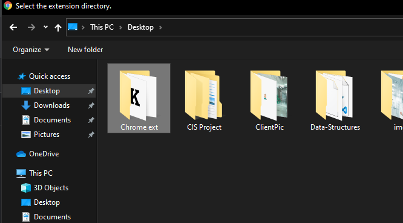
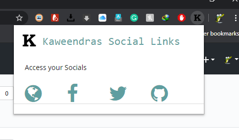

# Custom Chrome Extension

[![Contributors][contributors-shield]][contributors-url]
[![Stargazers][stars-shield]][stars-url]
[![Issues][issues-shield]][issues-url]
[![MIT License][license-shield]][license-url]
[![Fork][forks-shield]][forks-url]

[![alt text][1.1]][1]
[![alt text][2.1]][2]
[![alt text][3.1]][3]
[![alt text][6.1]][6]

## Guide

### Adding Chrome Extension to Browser

#### 1 Goto Extensions

  

#### 2 Enable Developer Mode

  

#### 3 Load Unpacked

  

#### 4 Select the Project folder

  

#### 5 Your Extension will appear

  

#### 6 Voila

  

<!-- MARKDOWN LINKS & IMAGES -->
<!-- https://www.markdownguide.org/basic-syntax/#reference-style-links -->
[contributors-shield]: https://img.shields.io/github/contributors/kaweendras/Custom-Chrome-Extension.svg?style=flat-square
[contributors-url]: https://github.com/kaweendras/Custom-Chrome-Extension/graphs/contributors
[forks-shield]: https://img.shields.io/github/forks/kaweendras/Custom-Chrome-Extension
[forks-url]: https://github.com/kaweendras/Custom-Chrome-Extension/network/members
[stars-shield]: https://img.shields.io/github/stars/kaweendras/Custom-Chrome-Extension.svg?style=flat-square
[stars-url]: https://github.com/kaweendras/kaweendras.github.io/stargazers
[issues-shield]: https://img.shields.io/github/issues/kaweendras/Custom-Chrome-Extension.svg?style=flat-square
[issues-url]: https://github.com/kaweendras/Custom-Chrome-Extension/issues
[license-shield]: https://img.shields.io/github/license/kaweendras/Custom-Chrome-Extension.svg?style=flat-square
[license-url]: https://github.com/kaweendras/Custom-Chrome-Extensionblob/master/LICENSE.txt
[product-screenshot]: images/screenshot.png

[1.1]: http://i.imgur.com/tXSoThF.png (twitter)
[2.1]: http://i.imgur.com/P3YfQoD.png (facebook)
[3.1]: http://i.imgur.com/yCsTjba.png (google plus)
[6.1]: http://i.imgur.com/0o48UoR.png (github)

[1]: http://www.twitter.com/dear__spider
[2]: http://www.facebook.com/kaweendra
[3]: https://plus.google.com/salithak1
[6]: http://www.github.com/kaweendras
